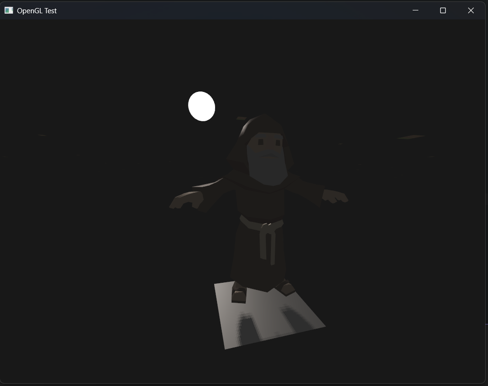
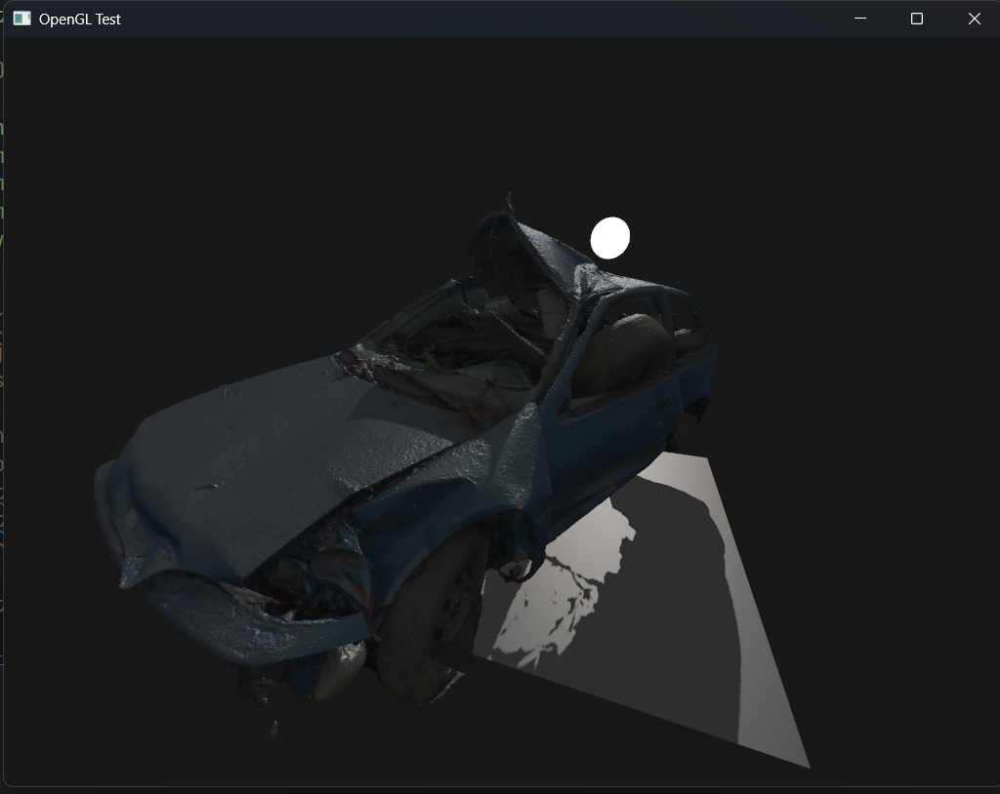

# Project Description

Toy project to understand how 3D engines work.

<p align="center">
  
  
</p>

It includes several custom built features like:

- Entity Component System powered by [EnTT](https://github.com/skypjack/entt) with texture loading and all required stuff
- Instance (Batch) rendering using OpenGL's instance buffers
- Custom C++ basics (prelude) implementations like arrays and file loaders
- Self-written Wavefront `.obj` model files parser
- Input handling, camera movements etc.

## Building on Windows

In order to configure and run project on windows platform accomplish several steps.

### Configuring

```console
cmake -S . -B build -G "Visual Studio 17 2022" -DCMAKE_TOOLCHAIN_FILE=C:/vcpkg/scripts/buildsystems/vcpkg.cmake -DCMAKE_BUILD_TYPE=Release
```

### Building

```console
cmake --build build --config Release
```

### Static Linking

For static linking you just need to modify the configure command as follows:

```console
cmake -S . -B build -G "Visual Studio 17 2022"-DCMAKE_TOOLCHAIN_FILE=C:/vcpkg/scripts/buildsystems/vcpkg.cmake -DVCPKG_TARGET_TRIPLET=x64-windows-static -DCMAKE_BUILD_TYPE=Release -DENGINE_BUILD_SHARED=OFF
```

## Multi-GPU Devices

If you want to use non-primary GPU on your device when launching the game specifically on Linux you should specify additional environment variables before running. For example in my case I have a hybrid gaming laptop with 2 GPUs AMD from CPU and NVIDIA discrete.

The run command in that case would look following:

```console
__NV_PRIME_RENDER_OFFLOAD=1 __GLX_VENDOR_LIBRARY_NAME=nvidia <executable_path>
```
